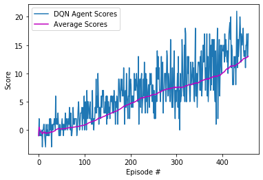

## Project 1 Report - Navigation

### Introduction

This project involved using Deep Reinforcement Learning (DRL) to train an agent how to navigate an environment and collect bananas in a large square world.

This project trained the agent how to collect yellow bananas from the environment, while being able to differentiate between yellow and blue banana, avoiding blue bananas in the process.

A reward of +1 was given to the agent for collecting a yellow banana, and a reward of -1 is for collecting a blue banana.  Thus, the goal of the agent was to collect as many yellow bananas as possible while avoiding blue bananas. 

The state space had 37 dimensions and contained the agent's velocity, along with ray-based perception of objects around the agent's forward direction.  Given this information, the agent had to learn how to best select actions. Four discrete actions were available:
- **`0`** - move forward.
- **`1`** - move backward.
- **`2`** - turn left.
- **`3`** - turn right.
The task was episodic, and the agent had to solve the environment, by getting an average score of +13 over 100 consecutive episodes.

### Learning Algorithm

Deep Q-Learning (DQN) was the algorithm used to solve this environment adopted from DQN Networks in Part 2, Lesson 2. The general concept of the algorithm is to find the optimal policy for the agent through trial and error in order for the agent to solve the environment through getting rewards for correct actions taken (collecting yellow bananas).

The environment was solved by the agent getting an average score of 13.02 above the target score of 13.0 in 457 episodes.

The network architecture model had three (3) linear layers with RELU as the activation function for each layer in the model.py file with an input state size of 37, hidden layers (size – 64) and output actions size of 4.

##### The Learning algorithm uses the following:
* ***Q Function*** uses a Deep Neural Netowrk (the network model architecture) to approximate the Q-Function by discovering an optimal policy from calculating the expected reward for the all actions, in all states. 
* ***Experience replay*** to train through mini-batches from the replay buffer by sampling experiences uniformly at random from the replay memory.
* ***Epsilon Greedy policy*** where the agent selects the next action from the action space at random.

The hyperparameters used to train the DQN Agent were:
* ***n_episodes=2000, max_t=1000, eps_start=1.0, eps_end=0.01, eps_decay=0.995***

### Trained DQN Results

The figure below shows the trained DQN Agent results with a moving average. The average score was 13.02 after 457 episodes.

### Ideas For Future Network

This project has utilized the Deep Q Learning algorithm (DQN). For further and future work, I plant to try the following to see how they perform in comparison to DQN:
1. ***Double DQN***
2. ***Dueling DQN***
3. **Prioritized Experience Replay: *** 
